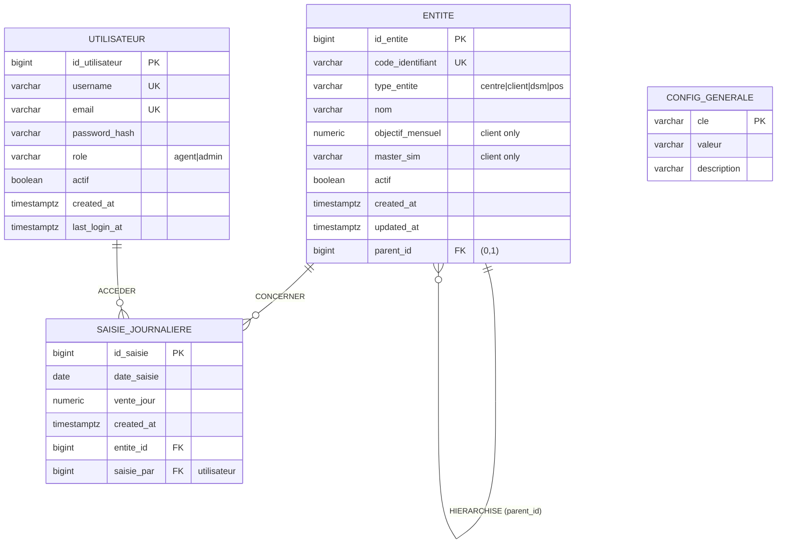

# 03 — Modèle Conceptuel des Données (MCD) — Camtel-Pulse

> Projet : **Camtel-Pulse** — Suivi des objectifs commerciaux des partenaires CAMTEL
> Méthode Merise — Modèle Conceptuel des Données

---

## 1. Entités conceptuelles

### ENTITÉ
Entité `ENTITE` (représente Centre, Client, DSM, POS)
- **id_entite** (PK)
- **code_identifiant** (UK)
- **type_entite** : {centre, client, dsm, pos}
- **nom**
- **objectif_mensuel** (⚠ seulement pour client)
- **master_sim** (⚠ seulement pour client)
- **actif**
- **created_at**, **updated_at**

### SAISIE
Entité `SAISIE_JOURNALIERE`
- **id_saisie** (PK)
- **date_saisie**
- **vente_jour**
- **created_at**

### UTILISATEUR
Entité `UTILISATEUR`
- **id_utilisateur** (PK)
- **username** (UK)
- **email** (UK)
- **password_hash**
- **role** : {agent, admin}
- **actif**
- **created_at**, **last_login_at**

### CONFIG
Entité `CONFIG_GENERALE`
- **cle** (PK)
- **valeur**
- **description**

---

## 2. Associations conceptuelles

### Association HIERARCHISE (auto-référente)
Relie `ENTITE` à `ENTITE` (elle-même).
- Une entité de niveau N est rattachée à une entité de niveau N−1 (son parent).
- Un parent peut avoir plusieurs enfants.
- **Cardinalité** : `(0,1)` côté parent (un centre n'a pas de parent) ; `(0,N)` côté enfant (un parent peut avoir plusieurs enfants).

```
ENTITE (parent) (0,N) —HIERARCHISE— (0,1) ENTITE (enfant)
```

### Association CONCERNER
Relie `ENTITE` à `SAISIE_JOURNALIERE`.
- Une entité (client, DSM ou POS) est concernée par plusieurs saisies journalières.
- Une saisie journalière concerne une seule entité.
- **Cardinalité** : `(1,1)` côté saisie ; `(0,N)` côté entité.

```
ENTITE (0,N) —CONCERNER— (1,1) SAISIE_JOURNALIERE
```

### Association ACCEDER
Relie `UTILISATEUR` à `SAISIE_JOURNALIERE` (traçabilité, optionnel).
- Un utilisateur peut créer plusieurs saisies.
- Une saisie est créée par un utilisateur (optionnel, pour traçabilité).
- **Cardinalité** : `(0,1)` côté saisie ; `(0,N)` côté utilisateur.

```
UTILISATEUR (0,N) —ACCEDER— (0,1) SAISIE_JOURNALIERE
```

---

## 3. Diagramme Mermaid (MCD)



---

## 4. Cardinalités détaillées

| Association | Entité A | Cardinalité | Entité B | Cardinalité | Signification |
|---|---|---|---|---|---|
| HIERARCHISE | ENTITE (parent) | 0,N | ENTITE (enfant) | 0,1 | Un parent a plusieurs enfants ; un enfant a au plus un parent |
| CONCERNER | ENTITE | 0,N | SAISIE_JOURNALIERE | 1,1 | Une entité a plusieurs saisies ; une saisie porte sur une entité |
| ACCEDER | UTILISATEUR | 0,N | SAISIE_JOURNALIERE | 0,1 | Un utilisateur crée plusieurs saisies ; une saisie a au plus un créateur |

---

## 5. Justification du choix conceptuel

- **Entité unifiée `ENTITE`** : la hiérarchie Centre/Client/DSM/POS est une structure arborescente homogène. Une entité unique avec `type_entite` et `parent_id` auto-référent permet de modéliser l'arbre proprement, de garantir l'intégrité référentielle par une vraie FK, et de simplifier l'agrégation POS → DSM → Client → Centre (RG-32).
- **Attributs conditionnels** (`objectif_mensuel`, `master_sim`) : réservés aux clients, mais portés par l'entité unique pour éviter la multiplication des tables. Leur caracteré conditionnel est encadré par des contraintes CHECK côté MPD.
- **`SAISIE_JOURNALIERE`** : porte uniquement la vente du jour. Les cumuls et écarts sont dérivés (non stockés) — conformité aux documents (RG-12, RG-13, RG-14).
- **`UTILISATEUR`** : sécurisation de l'accès (RG-35) avec rôle (agent/admin).
- **`CONFIG_GENERALE`** : paramètres évolutifs (jours/mois, jours de stock de sécurité) pour la préparation de l'application web.

---

## 6. Récapitulatif des entités et associations

| Type | Nom | Rôle |
|---|---|---|
| Entité | ENTITE | Hiérarchie commerciale (Centre/Client/DSM/POS) |
| Entité | SAISIE_JOURNALIERE | Vente du jour par entité |
| Entité | UTILISATEUR | Comptes d'accès |
| Entité | CONFIG_GENERALE | Paramètres globaux |
| Association | HIERARCHISE | Arborescence auto-référente |
| Association | CONCERNER | Lien entité → saisies |
| Association | ACCEDER | Lien utilisateur → saisies (traçabilité) |
