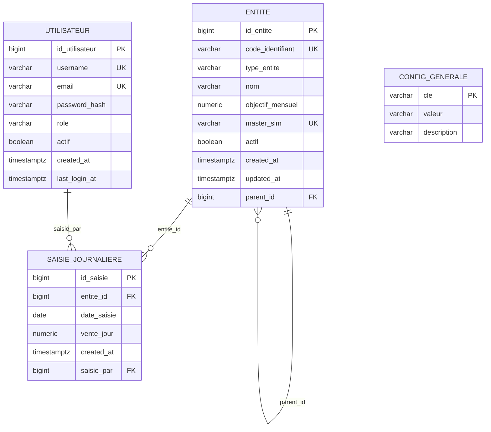

# 04 — Modèle Logique des Données (MLD) — Camtel-Pulse

> Projet : **Camtel-Pulse** — Suivi des objectifs commerciaux des partenaires CAMTEL
> Méthode Merise — Modèle Logique des Données (relations relationnelles)

---

## 1. Règles de transformation MCD → MLD

| Association MCD | Transformation MLD |
|---|---|
| HIERARCHISE (auto-référente, 0,N ↔ 0,1) | Clé étrangère `parent_id` dans `ENTITE` |
| CONCERNER (0,N ↔ 1,1) | Clé étrangère `entite_id` dans `SAISIE_JOURNALIERE` |
| ACCEDER (0,N ↔ 0,1) | Clé étrangère `saisie_par` dans `SAISIE_JOURNALIERE` |

---

## 2. Relations logiques

### Relation `ENTITE`
```
ENTITE (id_entite, code_identifiant, type_entite, nom, objectif_mensuel,
        master_sim, actif, created_at, updated_at, parent_id)
```
- **PK** : `id_entite`
- **UK** : `code_identifiant`, `master_sim` (partielle)
- **FK** : `parent_id` → `ENTITE(id_entite)`
- **Contraintes** : `type_entite IN (centre, client, dsm, pos)` ; `objectif_mensuel ≥ 0` ; `master_sim` unique si renseigné

### Relation `SAISIE_JOURNALIERE`
```
SAISIE_JOURNALIERE (id_saisie, entite_id, date_saisie, vente_jour, created_at, saisie_par)
```
- **PK** : `id_saisie`
- **UK** : `(entite_id, date_saisie)`
- **FK** : `entite_id` → `ENTITE(id_entite)` ; `saisie_par` → `UTILISATEUR(id_utilisateur)`
- **Contraintes** : `vente_jour ≥ 0`

### Relation `UTILISATEUR`
```
UTILISATEUR (id_utilisateur, username, email, password_hash, role, actif, created_at, last_login_at)
```
- **PK** : `id_utilisateur`
- **UK** : `username`, `email`
- **Contraintes** : `role IN (agent, admin)`

### Relation `CONFIG_GENERALE`
```
CONFIG_GENERALE (cle, valeur, description)
```
- **PK** : `cle`

---

## 3. Schéma relationnel (diagramme Mermaid)



---

## 4. Normalisation

| Relation | Forme normale | Justification |
|---|---|---|
| ENTITE | 3NF | Attributs non-clés dépendants de la PK ; pas de dépendance transitive ; l'attribut conditionnel `objectif_mensuel` ne dépend que de la PK |
| SAISIE_JOURNALIERE | 3NF | `vente_jour` dépend de `(entite_id, date_saisie)` ; pas de redondance |
| UTILISATEUR | 3NF | Tous les attributs dépendent de la PK |
| CONFIG_GENERALE | 3NF | Relation clé/valeur simple |

> **Note sur l'attribut conditionnel** : `objectif_mensuel` et `master_sim` ne sont pertinents que pour les clients. Les conserver dans `ENTITE` (avec NULL pour les autres types) évite une multiplication de tables spécialisées tout en restant en 3NF — le caractère conditionnel est levé par les contraintes CHECK du MPD.

---

## 5. Récapitulatif des relations

| Relation | PK | FK | UK |
|---|---|---|---|
| ENTITE | id_entite | parent_id → ENTITE | code_identifiant, master_sim |
| SAISIE_JOURNALIERE | id_saisie | entite_id → ENTITE ; saisie_par → UTILISATEUR | (entite_id, date_saisie) |
| UTILISATEUR | id_utilisateur | — | username, email |
| CONFIG_GENERALE | cle | — | — |
